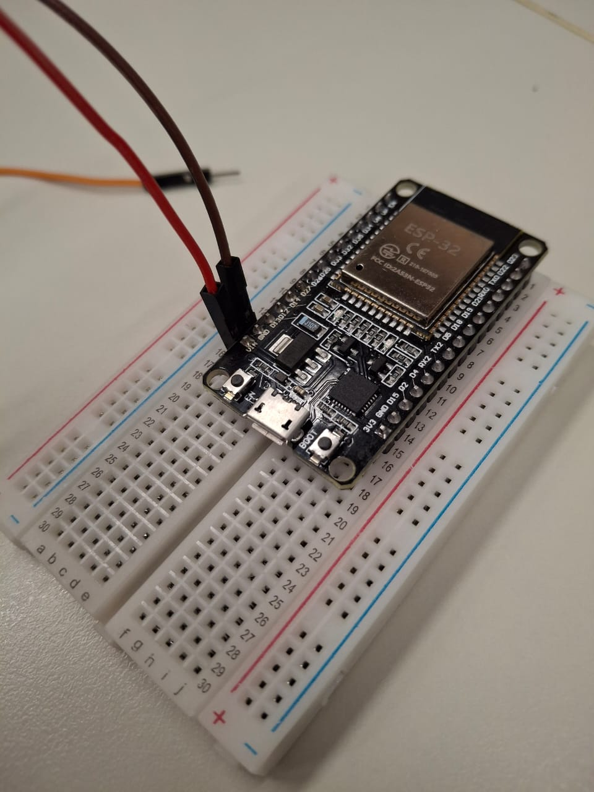
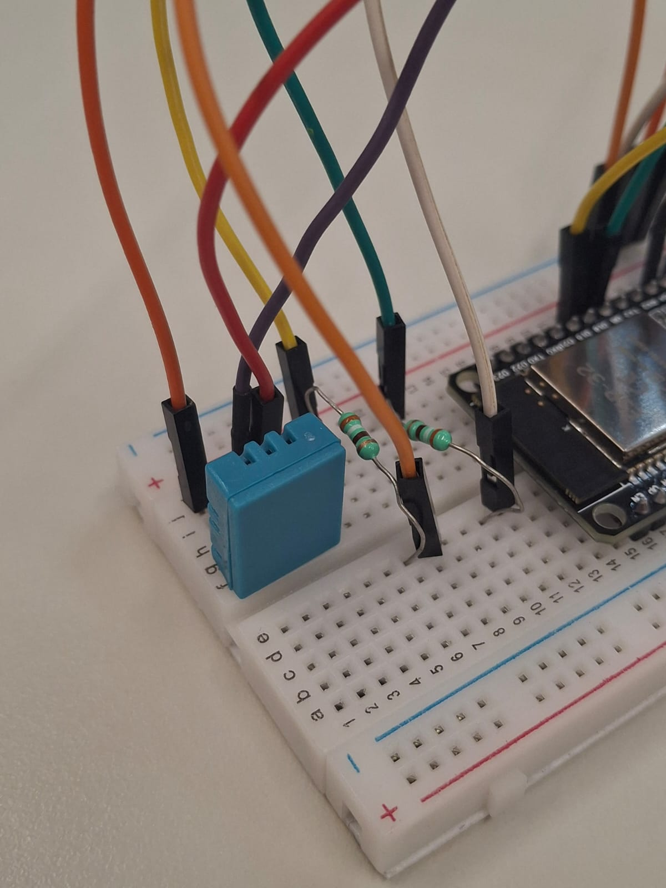

# Tutorial Montagem Servo/Motor | ESP-32 - Passo a Passo

### 1️⃣ Passo 1  


### 2️⃣ Passo 2  


### 3️⃣ Passo 3  


### 4️⃣ Passo 4  


### 5️⃣ Passo 5  


### 6️⃣ Passo 6  


### 7️⃣ Passo 7  


### 8️⃣ Passo 8  


### 🏁 Passo 9 — Resultado Final   


### 💻 Código - Servo/Motor para Arduino IDE:

```cpp
#include <ESP32Servo.h>

Servo meuServo;

void setup() {
  meuServo.setPeriodHertz(50);
  meuServo.attach(14);
}

void loop() {
  meuServo.write(180);
  delay(1000);

  meuServo.write(90);
  delay(1000);

  meuServo.write(0);
  delay(1000);

  meuServo.write(90);
  delay(1000);

  meuServo.write(180);
  delay(1000);
}

```

---

# Tutorial Montagem DHT/Temperatura | ESP-32 - Passo a Passo

### 1️⃣ Passo 1  


### 2️⃣ Passo 2  


### 3️⃣ Passo 3  


### 4️⃣ Passo 4  


### 5️⃣ Passo 5  


### 6️⃣ Passo 6  


### 7️⃣ Passo 7  


### 8️⃣ Passo 8  


### 9️⃣ Passo 9 


### 🔟  Passo 10  


### 🏁 Passo 11 — Resultado Final 


### 💻 Código - DHT/Temperatura para Arduino IDE:

```cpp

#include <Bonezegei_DHT11.h>

Bonezegei_DHT11 dht(2);

const int LED_VERDE = 18;
const int LED_VERMELHO = 5;

void setup() {
  Serial.begin(115200);
  dht.begin();

  pinMode(LED_VERDE, OUTPUT);
  pinMode(LED_VERMELHO, OUTPUT);
}

void loop() {

  if (dht.getData()) {
    float tempC = dht.getTemperature();
    float tempF = dht.getTemperature(true);
    int hum = dht.getHumidity();

    Serial.print("Temp: ");
    Serial.print(tempC);
    Serial.print(" °C / ");
    Serial.print(tempF);
    Serial.print(" °F | Humidity: ");
    Serial.print(hum);
    Serial.println(" %");
  }

  if (dht.getTemperature() < 23) {
    digitalWrite(LED_VERDE, LOW);
    digitalWrite(LED_VERMELHO, HIGH);
  } else {
    digitalWrite(LED_VERDE, HIGH);
    digitalWrite(LED_VERMELHO, LOW);
  }

  delay(2000);
}


```
